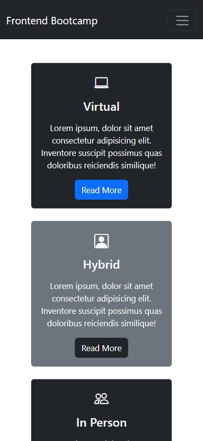

# Web Development Bootcamp - A Website Built with Bootstrap

Frontend Bootcamp is a comprehensive, fully responsive landing page. The code contains:

- Front-end Framework (Bootstrap)
- CDN for icons
- Web API's
- JavaScript

Go to website:https://seliun.github.io/Web-Development-Bootcamp-Website/

## ✨ How It Looks:

### Desktop ⬇️

### Mobile ⬇️

